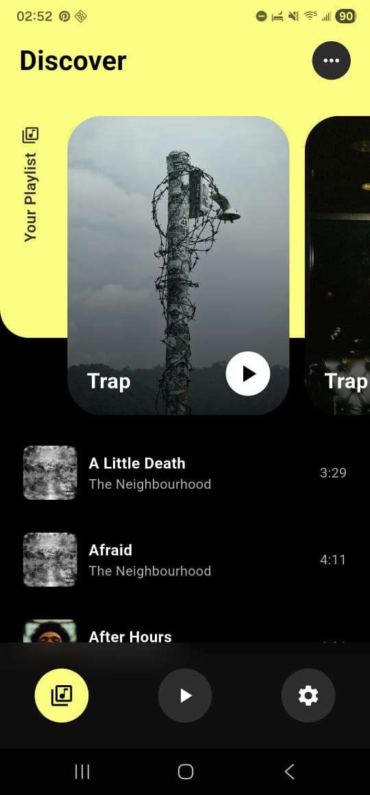
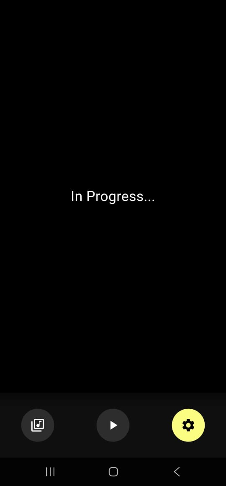

# 🎵 Discover Music App

[](https://flutter.dev/)
[](https://dart.dev/)

Aplicación de música inspirada en un diseño moderno de Dribbble. Permite explorar canciones, navegar por albums y ver listas de reproducción con un diseño limpio y efectos visuales atractivos.

🔹 Características
- Reproduccion de musica almacenada en el dispositivo
- Carrusel horizontal de albums con imágenes escaladas y redondeadas.
- Lista vertical de canciones con título, artista y duración.
- Efecto blur/frosted glass en los cards de albums.
- Diseño responsive y oscuro, ideal para exploración de música.
- Manejo de estado con Provider (songsProvider).


# 📂 Estructura del proyecto

```bash
assets/                  # Imágenes y recursos
docs/                    # Capturas de pantalla y GIFs para README
lib/
├── main.dart            # Punto de entrada
├── core/                # Configuraciones y constantes generales
├── data/                # Modelos y repositorios de datos
├── providers/           # Providers de estado
├── ui/                  # Pantallas y widgets
└── util/                # Utilidades y helpers (ej. Images.dart)

```

## 🔹 Capturas de pantalla
Pantalla principal:





## 🎨 Inspiración de diseño

Este proyecto toma como referencia el concepto UI de una app de música altamente visual y moderna:


Diseño original por Ronas IT | UI/UX Team en Dribbble 💡  
(https://dribbble.com/shots/23609232-Music-App-UI) :contentReference[oaicite:3]{index=3}
